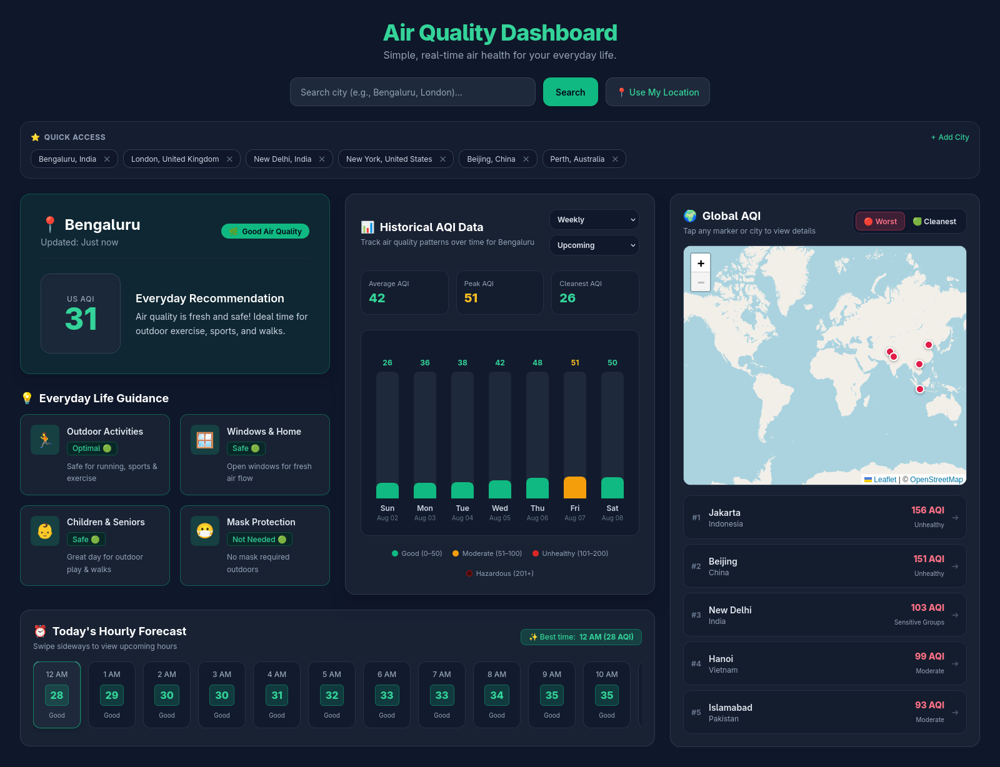
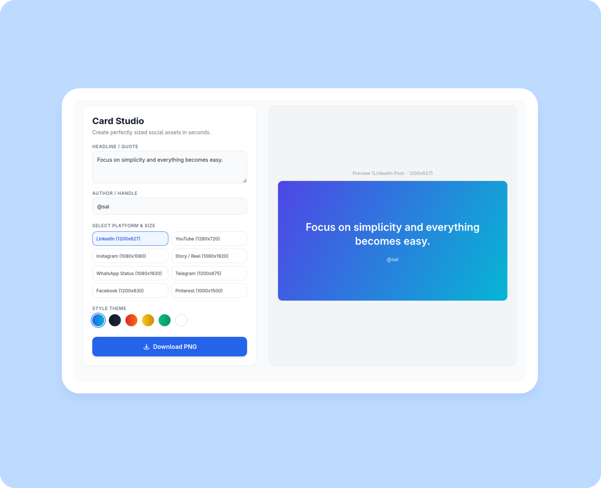

# Hi 👋, I'm Samatha Om 
### Lead Front-End Engineer | Full Stack Engineer

I craft high-performance web applications and intuitive design systems. 
Focusing on clean code, design thinking, and cloud architecture.

---

### ⚡ Quick Highlights
- 🧠 **10+ Years Experience** across Engineering, Product Design, and Tech Leadership.
- 🚀 Built low-latency apps using **React, Vue, WebSockets & AWS**.
- 🛠️ Modernized 1-12 CS pedagogy & led international tech teams of 20+.

---

### 🛠️ Core Tech Stack

```text
Frontend  : HTML5/CSS3 | JavaScript | React | Next.js | Angularjs | Vue.js | TypeScript | Tailwind CSS
Backend   : Node.js | REST APIs | WebSockets | Serverless
Cloud     : AWS (Lambda, S3, DynamoDB, EC2, CloudFront) | GCP
Design    : Figma | Design Systems | UI/UX Research | Rapid Prototyping
```
---

### 📌 Featured Projects

| <a href="https://airqidashboard.vercel.app/"></a> <br>**[Real-Time Global Air Quality Dashboard](https://airqidashboard.vercel.app/)** | <a href="https://work.samathaom.vercel.app/cardstudio.html"></a> <br>**[Card Studio — Instant Design Tool](https://work.samathaom.vercel.app/cardstudio.html)**  |
| :--- | :--- |
